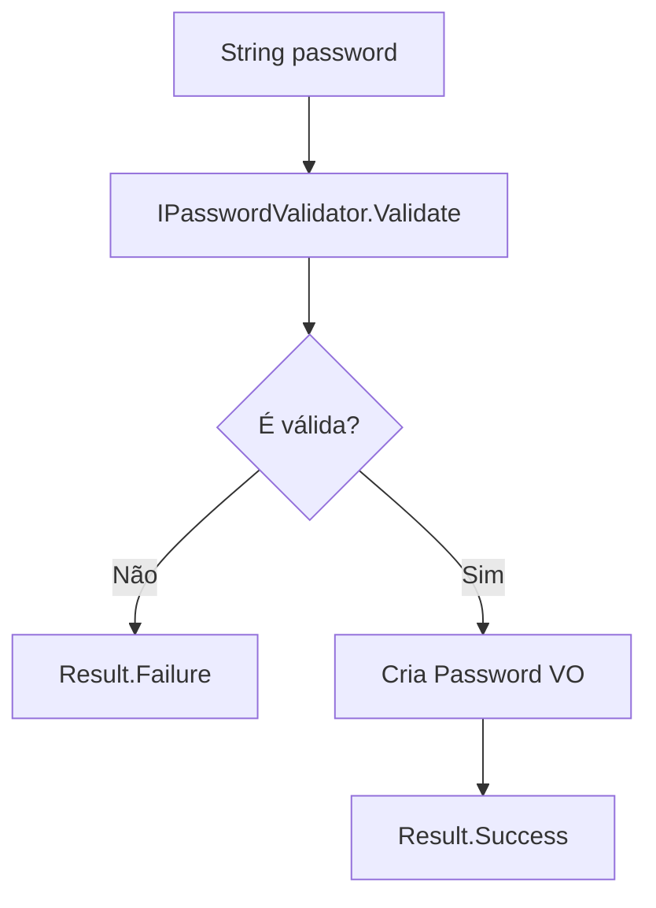
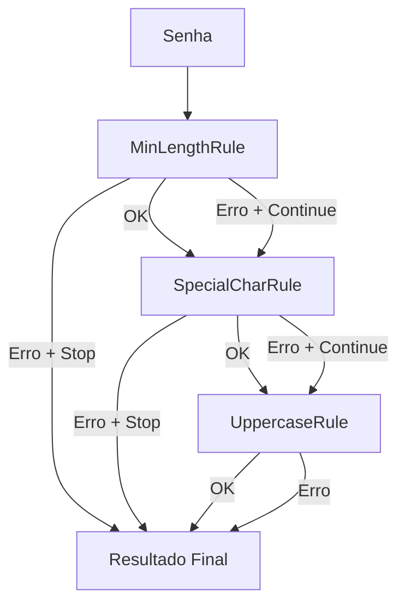

# Secure Password Validator (SPV)

## 📌 Visão Geral
O **Secure Password Validator (SPV)** é um mecanismo extensível de validação de senhas utilizando padrões avançados de projeto, como **Chain of Responsibility**, **Strategy**, **Value Object** e **Ruleset Composition**.  
Com suporte a múltiplas versões (V1, V2, …), é ideal para APIs versionadas, cenários multi-clientes e validações plugáveis via configuração.

---

## 🚀 Funcionalidades
- Validação encadeada com opção de parar no erro ou continuar (`ContinueIfErrorOccurs`)
- Value Object imutável para representação da senha
- Regras plugáveis via DI
- Result pattern para resultados ricos
- Suporte a múltiplas versões de validador
- Extensível para validação baseada em JSON/YAML

---

## 🧬 Arquitetura — C4 Model

### **C4 — Nível 1: Contexto**
```
System_Boundary("SPV", "Secure Password Validator") {
    Person(User, "Cliente da API", "Sistema que envia senhas para validação")
    System(API, "Password Validation API", "Expõe endpoints de validação")
    System(SPV, "Secure Password Validator Core", "Executa regras e retorna erros")
}
Rel(User, API, "Chama endpoints de validação")
Rel(API, SPV, "Envia senha e solicita validação")
```

---

### **C4 — Nível 2: Containers**
```
Container_Boundary("API") {
    Container("Minimal API", "ASP.NET 9", "Responsável por expor endpoints REST")
}

Container_Boundary("Core") {
    Container("Rules Engine", "C#", "Executa as regras de validação")
    Container("Ruleset V1", "C#", "Regras básicas")
    Container("Ruleset V2", "C#", "Regras avançadas + CoR")
    Container("Shared Kernel", ".NET", "Erros, resultados, abstrações")
}
```

---

### **C4 — Nível 3: Componentes**
```
Component("Password", "Value Object", "Imutável")
Component("IPasswordValidator", "Interface", "Define contrato de validação")
Component("RulesetPasswordValidatorV2", "Concrete", "Executa regras com Chain of Responsibility")
Component("Validator<T>", "Engine", "Processa regras individuais")
Component("IValidationRule", "Rule Interface", "Define regras de validação")
Component("Result<T>", "DTO", "Retorno seguro e tipado")
Component("ValidationResult", "DTO", "Lista de erros de validação")
```

---

## 🏛️ Diagrama de Fluxo da Validação


---

## 🧱 Diagrama Chain of Responsibility


---

## 📦 Estrutura de Pastas Recomendada
```
/src
 ├── Domain
 │    ├── Validators
 │    │     ├── Interfaces
 │    │     ├── RulesetPasswordValidatorV1.cs
 │    │     └── RulesetPasswordValidatorV2.cs
 │    ├── ValueObject
 │    │     └── Password.cs
 │
 ├── Shared
 │    ├── Validator.cs
 │    ├── Error.cs
 │    ├── Result.cs
 │    └── ValidationResult.cs
 │
 └── Application
      └── PasswordService.cs
```

---

## 🔄 Diferenciais entre V1 e V2
| Característica | V1 | V2 |
|----------------|-----|------|
| Padrão | Strategy + Lista de regras | Strategy + Chain of Responsibility |
| Continuação após erro | ❌ Não | ✔️ Sim |
| Extensibilidade | Média | Alta |
| Configurável via JSON/YAML | Limitado | Total |
| Multi-clientes | Pouco flexível | Altamente adaptável |

---

## 🧪 Testes
- Totalmente testável por unidade
- Rules independentes permitem mocks simples
- Result<T> evita exceções desnecessárias

---

## 🔧 Tecnologias
- .NET 9
- C#
- Minimal API
- DDD
- Clean Architecture (light)
- Mermaid + C4

---

## 📄 Licença
MIT — livre para usar e modificar.

---

## ✨ Autor
Documentação gerada automaticamente via ChatGPT.  
Se quiser um **README.md ainda mais completo**, posso gerar badges por CI, exemplos de requests, diagramas de sequência e muito mais.
